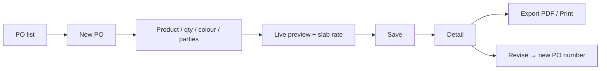
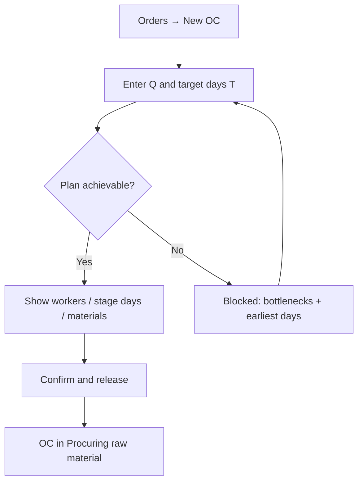
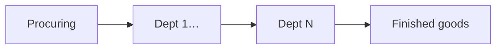
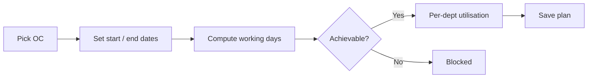

# Kreuger — Manufacturing operations dashboard

Internal plant-manager tool for an interior-design furniture manufacturer in India. It sits **alongside** SAP Business One and Zoho CRM (neither is replaced) and covers quoting, capacity planning, stage tracking, and manpower planning that the plant currently handles by phone, email, and memory.

Demo-first: seed data drives the model. Master data is editable so real plant numbers can replace seed values without code changes.

---

## Quick start

```bash
npm install
npm run seed    # reset MongoDB to sample plant data
npm run dev     # http://localhost:3000
```

Sign in with a seeded user from `prisma/seed.ts`.

| Script | Purpose |
|--------|---------|
| `npm run dev` | Local Next.js app |
| `npm run seed` | Restore sample products, OCs, POs, alerts |
| `npm run build` / `start` | Production build |

---

## Features

### 1. Dashboard (`/`)
- Active order confirmations (OCs) and at-risk count
- Purchase orders created this calendar month
- Live OC table: number, product, qty, current stage, days in stage, deadline status (on track / at risk / breached)

### 2. Purchase orders (`/quotations`)
Commercial POs (routes stay under `/quotations`; UI says **Purchase orders**).

- List, create, revise, detail, print view, PDF export
- Product + quantity → slab-based unit rate (live)
- Colour → product colour image on preview
- Party fields: vendor, ship-to, contact, delivery, payment terms, discount, remarks
- Product HSN/SAC and specs from master data
- PDF / on-screen preview: letterhead, meta grid, tax columns (CGST/SGST from settings GST %), amount in words

### 3. Orders — capacity planning (`/orders`)
- New OC: product, quantity, colour, target days
- Live capacity plan (pipelined departments) or **blocked** state with named bottlenecks and earliest achievable days
- Confirm & release → stage tracker starts at procurement
- Cancel order (when allowed)

### 4. Order detail — stage follow-up (`/orders/[id]`)
- Horizontal stage pipeline with countdown vs deadline
- Advance to next stage (writes stage events + queues alerts)
- Delay / variance breakdown per stage
- Link into manpower plan for that OC

### 5. Manpower efficiency (`/manpower`, `/manpower/[ocId]`)
- Date-range capacity plan per OC (working days exclude weekly offs + holidays)
- Per-department workers, hours, utilisation
- Achievable vs blocked; save plan explicitly
- Weekly off + holidays editable in master data

### 6. Reports (`/reports`)
- On-time performance, stage duration, bottleneck views over closed / historical OCs

### 7. Alerts (`/alerts`)
- Chronological log of stage-entry and deadline-breach notifications
- Formatted like an inbox (recipient, subject, body, time)
- Real SMTP only if `ENABLE_EMAIL=true` (off by default)

### 8. Master data (`/master-data`)
| Tab | What it drives |
|-----|----------------|
| Departments | Headcount, units/worker/day, daily ceiling, stage order, heads |
| Products | Base rate, lead days, HSN, specs, materials, pricing slabs, colour images, per-product rate overrides |
| Recipients | Escalation contacts (plant / procurement / dispatch) |
| Timeline settings | Procurement days, ramp days, shift hours, GST % |
| Weekly off & holidays | Working-day calendar for manpower |
| Users (Admin) | Accounts and roles: Admin / Manager / Viewer |

### 9. Auth & roles
- Login session; middleware-protected app routes
- **Admin** — edit master data & users  
- **Manager** — operate POs, orders, manpower  
- **Viewer** — read-only where enforced  

---

## Functional flows

### A. Purchase order (commercial PDF)



1. Open **Purchase orders** → **New**.
2. Choose product and colour; enter quantity (rate updates from pricing slabs).
3. Fill vendor / ship-to / delivery / commercial fields.
4. Confirm live preview matches intended PDF layout.
5. Save → open detail → **Export PDF** or print view.
6. Optionally **Revise** to create a linked successor PO.

### B. Order confirmation + capacity (Scenario 3)



Core idea: stages are **pipelined** (overlapped), not sequential.  
`productionWindow = T − procurementDays − rampDays`; required rate = `Q / window`. Departments that cannot meet the rate appear as bottlenecks.

### C. Stage-wise follow-up (Scenario 4)



1. Open OC detail → see current stage + countdown.
2. **Advance stage** closes the current event, opens the next, queues `stage_entry` alert to the next dept head.
3. If the finished stage (or current elapsed time) exceeds deadline → `deadline_breach` alert to plant head.
4. Closed / in-progress OCs show planned vs actual duration variance.

Default stage list: **Procuring raw material** → departments in sequence → **Finished goods**.

### D. Manpower plan



Uses the same procurement / ramp / shift constants as OC planning, plus weekly offs and holidays for calendar working days.

### E. Alerts path

Advance or breach sync → write `Alert` row → show on **Alerts** (and optionally send email if enabled).

---

## Screen map

| Route | Screen |
|-------|--------|
| `/login` | Sign in |
| `/` | Dashboard |
| `/quotations` | Purchase order list |
| `/quotations/new` | New PO + live preview |
| `/quotations/[id]` | PO detail / preview |
| `/quotations/[id]/print` | Print-optimised HTML |
| `/quotations/[id]/pdf` | PDF download |
| `/orders` | OC list |
| `/orders/new` | New OC + capacity panel |
| `/orders/[id]` | Stage tracker + delay breakdown |
| `/manpower` | OC picker for manpower |
| `/manpower/[ocId]` | Date-range manpower plan |
| `/reports` | Ops reports |
| `/alerts` | Notification log |
| `/master-data` | Editable plant constants |
| `/master-data/products/[id]` | Product detail (slabs, materials, rates, images) |

---

## Data model (high level)

- **Settings** — procurement / ramp / shift / GST / escalation contacts  
- **Product** (+ materials, pricing slabs, colour images, department rate overrides)  
- **Colour**, **Department**  
- **Quotation** — commercial PO record (vendor/ship-to, rates, parties)  
- **OrderConfirmation** — OC + `OcDepartmentPlan` + `OcStageEvent`  
- **ManpowerPlan** / **ManpowerPlanLine** — saved date-range plan per OC  
- **Alert** — stage_entry / deadline_breach  
- **User**, **Holiday**

Authoritative field list: `prisma/schema.prisma`. Build rationale: `BUILD_SPEC.md`.

---

## Out of scope

Do not treat these as missing features of this app:

- Zoho CRM or SAP Business One sync  
- HRMS / employee management  
- Full MRP, procurement ticketing, GRN, quality  
- BOM as a separate ERP module  
- Always-on real email (demo writes to Alerts; SMTP is opt-in)

---

## Tech stack

- Next.js (App Router) + TypeScript  
- Tailwind + shadcn/ui  
- Prisma + MongoDB  
- PDF: `@react-pdf/renderer` (+ HTML print fallback)  
- Auth: session cookie + roles  

Server mutations live in `src/lib/actions.ts`, `actions-master-data.ts`, `actions-manpower.ts`, `auth-actions.ts`.
